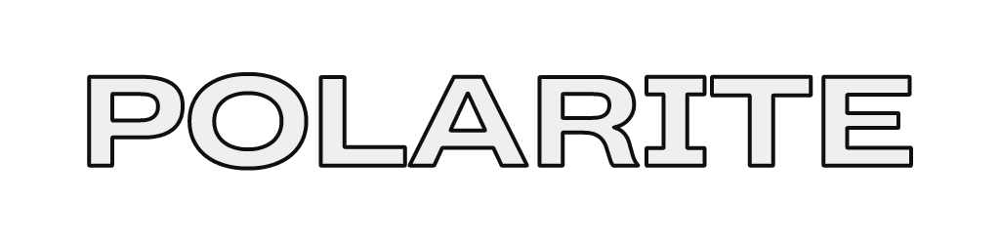

<kbd>

</kbd>

---

<div align="center">
    <strong><a href="https://polarite.teknologiumum.com">Polarite</a></strong> is a Pastebin alternative made for simplicity written in Go.
</div>

## Usage

### Web Interface
Visit https://polarite.teknologiumum.com

### API

Send a `POST` request to `https://polarite.teknologiumum.com` with:

- `Content-Type` header with the value of `text/plain`
- Non-empty `request body` consisting of the text you want to store
- `Authorization` header with the value of `Your Name <your email>` with a minimum of 15 characters.

Example request:

- cURL
```sh
curl \
    -H "Content-Type: text/plain" \
    -H "Authorization: John Doe <john@example.com>" \
    -X POST \
    -d "Hello World" \
    https://polarite.teknologiumum.com/
```

- Javascript (via Fetch API)
```js
fetch("https://polarite.teknologiumum.com/", {
    method: "POST",
    headers: {
        "Content-Type": "text/plain",
        "Authorization": "John Doe <john@example.com>"
    },
    body: "Hello world!"
})
```

- Go
```go
import (
    "net/http"
    "strings"
)

func Polarite() {
    body := strings.NewReader("Hello world")
    req, err := http.NewRequest(http.MethodPost, "https://polarite.teknologiumum.com/", body)
    req.Header.Add("Content-Type", "text/plain")
    req.Header.Add("Authorization", "John Doe <john@example.com>")

    client := &http.Client{}
    resp, err := client.Do(req)
}
```

- C#
```c#
using System.Net.Http;

var client = new HttpClient();
var request = new HttpRequestMessage() {
    RequestUri = new Uri("https://polarite.teknologiumum.com/"),
    Method = HttpMethod.Post,
    Headers = {
        { "Authorization", "John Doe <john@example.com>" },
        { "ContentType", "text/plain" }
    },
    Content = new StringContent("Hello world", Encoding.UTF8, "text/plain")
};

var task = await client.SendAsync(request);
```

### Available Options

Polarite uses [alecthomas/chroma](github.com/alecthomas/chroma). You can pass
some options to the highlighter by appending these parameters in the URL.
If none of these options are passed, you will get a plain text without any highlighting

- `lang`

    This option decides which language to use. See [alecthomas/chroma#supported-languages](https://github.com/alecthomas/chroma/#supported-languages) for supported languages.

    - `https://polarite.teknologiumum.com/your-unique-id?lang=go`
    - `https://polarite.teknologiumum.com/your-unique-id?lang=rust`

- `theme`

    This option decides which theme to use. See [alecthomas/chroma/styles](https://github.com/alecthomas/chroma/tree/master/styles) for supported themes.
    The default theme is dracula.

    - `https://polarite.teknologiumum.com/your-unique-id?theme=monokai`
    - `https://polarite.teknologiumum.com/your-unique-id?theme=nord`

- `linenr`

    This option decides whether to enable line number or not. A non empty value is considered as true.

    - `https://polarite.teknologiumum.com/your-unique-id?linenr=yes`
    - `https://polarite.teknologiumum.com/your-unique-id?linenr=true` This is also valid

You can, of course, combine the options.
For example: `https://polarite.teknologiumum.com/your-unique-id?lang=rust&theme=nord&linenr=true`

## Why the name, Polarite?

In the dawn of time, it began with the birth of [Graphene](https://github.com/teknologi-umum/graphene) repository, which its' name was picked from the name of a mineral.
Then, not so long after, another repository called [Flourite](https://github.com/teknologi-umum/flourite) emerged. It's actually a typo of Fluorite, another name of a mineral.
Now, where mankind stands, we want to continue that convention, to pick a name from a [list of mineral on Wikipedia](https://en.wikipedia.org/wiki/List_of_minerals).
